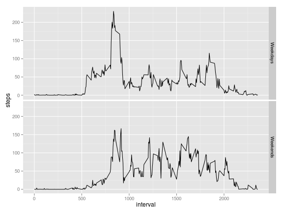

Reproducible Research Peer Assessment 1
========================================================

This is an peer assesment 1 for Coursera course Reproducible Research from Data Science Specialization.

## Loading data


```r
dt <- read.csv("./data/activity.csv")
```


## Histogram of the total number of steps


```r
dt.aggr <- aggregate(. ~ date, data = dt, sum)
hist(x = dt.aggr$steps, main = "Histogram of steps per day", xlab = "Steps per day")
```

 


## Mean and median of total number of steps
  

```r
s.mean <- as.integer(round(mean(dt.aggr$steps), 0))
s.median <- median(dt.aggr$steps)
```

The mean of steps taken per day is 10766.  
The meadian of steps taken per day is 10765.

## What is the average daily activity pattern?

Ploting average number of steps per day.


```r

dt.aggr.2 <- aggregate(. ~ interval, data = dt, mean)
time.int <- c("0:00", "3:00", "6:00", "9:00", "12:00", "15:00", "18:00", "21:00", 
    "24:00")
plot(x = dt.aggr.2$interval, y = dt.aggr.2$steps, type = "l", axes = F, xlab = "time interval", 
    ylab = "mean of steps", main = "")
axis(1, at = c(0, 300, 600, 900, 1200, 1500, 1800, 2100, 2400), lab = time.int)
axis(2, at = c(0, 50, 100, 150, 200))
```

 


Calculating maximum number of steps on average across all the day.


```r
# finding peak
day.peak <- as.character(dt.aggr.2$interval[dt.aggr.2$steps == max(dt.aggr.2$steps)])

# formating peak to sutible format inserting : fird place from the end of
# string
day.peak <- sub("(?<=.{1})", ":", day.peak, perl = TRUE)
```


On average maximum steps are made on 8:35


## Missing values 
### Number of rows with missing value


```r
sum.na <- sum(is.na(dt$steps))
```


In the data set was found **2304** mising value (rows with missing value)

### Missing values strategy

The missing values was filled with the mean for that 5-minute interval.

### Data set without NA


```r
dt.no.na <- dt

for (i in 1:dim(dt.no.na)[1]) {
    if (is.na(dt.no.na$steps[i])) {
        dt.no.na$steps[i] <- dt.aggr.2$steps[dt.aggr.2$interval == dt.no.na$interval[i]]
    }
}
```


### Histogram and summary statistic of the data without NA

Ploting original histogram of the steps per day and histogram with removed NA.


```r

dt2.aggr <- aggregate(. ~ date, data = dt.no.na, sum)

par(mfrow = c(1, 2))
hist(x = dt2.aggr$steps, main = "Histogram of steps per day \n        with removed NA", 
    xlab = "Steps per day")

hist(x = dt.aggr$steps, main = "Histogram of steps per day", xlab = "Steps per day")
```

 

```r

par(mfrow = c(1, 1))
```


```r
step.mean.NA <- as.integer(mean(dt2.aggr$steps))
step.median.NA <- as.integer(median(dt2.aggr$steps))
```


Mean of steps taken per day if the missing values are filled with the mean for that 5-minute interval is **10766**

Median of steps taken per day if the missing values are filled with the mean for that 5-minute interval is **10766**

By adding mean insted of NA we did not change the shape of the data per day.  

## Differences in activity patterns between weekdays and weekends.
  
Ploting average steps on weekend and on workday.
  

```r

# making colummn with weekday or weekend as factor
dt.no.na$days <- NA
for (i in 1:dim(dt.no.na)[1]) {
    if (weekdays(as.Date(dt.no.na$date[i])) == "Sunday" | weekdays(as.Date(dt.no.na$date[i])) == 
        "Saturday") {
        dt.no.na$days[i] <- "Weekend"
    } else {
        dt.no.na$days[i] <- "Weekday"
    }
}
dt.no.na$days <- as.factor(dt.no.na$days)

# calculating mean for eevery 5 min for weekday and weekend separately

aggr.days <- aggregate(. ~ interval, data = subset(x = dt.no.na, subset = dt.no.na$days == 
    "Weekday"), mean)
aggr.days$days <- "Weekdays"

aggr.ends <- aggregate(. ~ interval, data = subset(x = dt.no.na, subset = dt.no.na$days == 
    "Weekend"), mean)
aggr.ends$days <- "Weekends"

# adding all together

aggr.melt <- data.frame(interval = rep(NA, times = 576), steps = NA, date = NA, 
    days = NA)
for (i in 1:dim(aggr.days)[1]) {
    aggr.melt[2 * i - 1, ] <- aggr.days[i, ]
    aggr.melt[2 * i, ] <- aggr.ends[i, ]
}

aggr.melt$days <- as.factor(aggr.melt$days)

# ploting

library(ggplot2)

fig2 <- ggplot(data = aggr.melt, aes(x = interval, y = steps)) + geom_line()
fig2 + facet_grid(days ~ .)
```

 


We can see that at the weekend there are more activity in the middle of the day. Meanwhile on the workdays main activity is in the morning and in the evening. 


**In my opinion** this figure (optional) better shows workday/weekend trends


```r
plot(x = aggr.days$interval, y = aggr.days$steps, type = "l", axes = F, xlab = "time interval", 
    ylab = "number of steps")
axis(1, at = c(0, 300, 600, 900, 1200, 1500, 1800, 2100, 2400), lab = time.int)
axis(2, at = c(0, 50, 100, 150, 200))
lines(x = aggr.ends$interval, y = aggr.ends$steps, col = "red")
box()
legend("topright", legend = c("Weekday", "Weekend"), col = 1:2, lty = 1)
```

 

